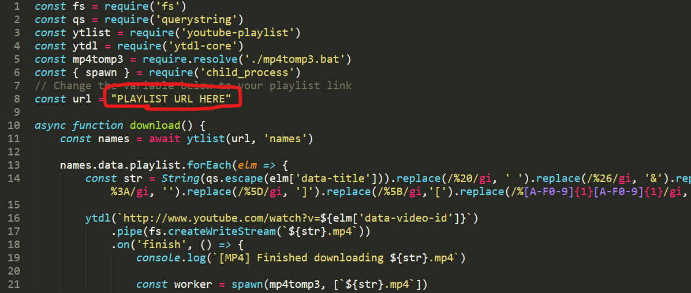

# Youtube Playlist Downloader

## Download and convert your Youtube playlist to mp3 with ease

### How to use:
1) Install dependencies

```bash
npm install
```

2) Put your Youtube playlist URL in `index.js` on **line 8**



3) Run the file

```bash
node index.js
```

4) JAM!!

### Requirements:
- Node.js
- Windows
- ffmpeg